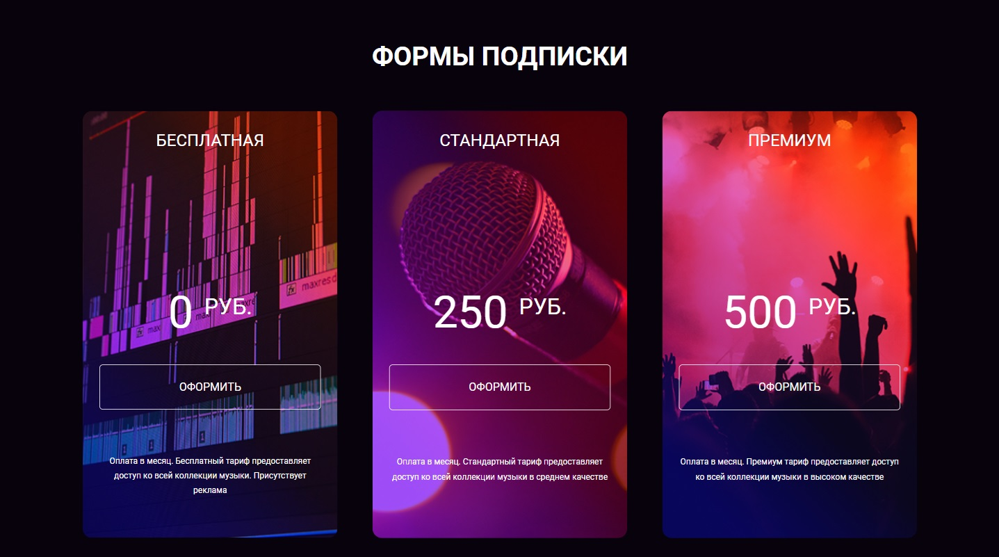
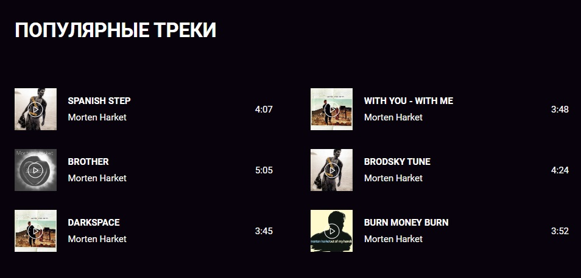
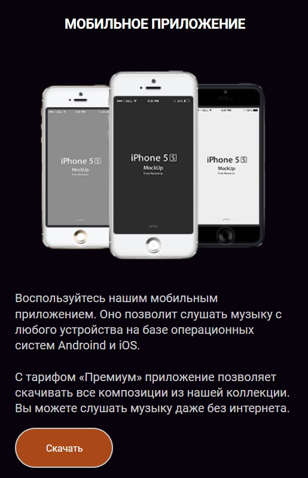

# Music Box

### Hexlet tests and linter status:

[](https://github.com/hitriylis/layout-designer-project-56/actions)

## Description

Music Box - is a project to create two landings for the music portal “Music Box”. The portal provides access to online listening to music. The project uses the following approaches: positioning, adaptivity, Flex, Grid, SASS, OOCSS and Atomic CSS, deployment in Surge.

## Install

```bash
git clone git@github.com:hitriylis/MusicBox
```

```bash
make install
```

```bash
make deploy
```

## Demonstration:

- Laptop size:

  

---

- Tablet size:

  

---

- Mobile size:

  

---

### Click [here](https://music_box.surge.sh) to view in browser.
